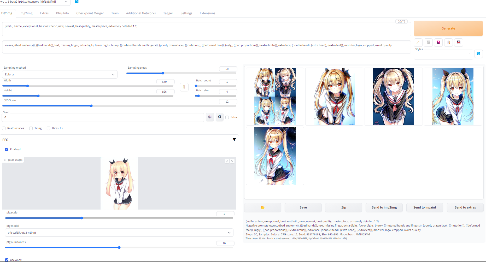

# pfg-webui
[PFG](https://github.com/laksjdjf/pfg)(Prompt Free Generation) is a method of guiding with an image by concatenating the image into a text encoder hidden states.
It can generate a variety of images without prompting.

※This script works after [it](https://github.com/AUTOMATIC1111/stable-diffusion-webui/pull/8064) merged.

# Method
1. Convert image into (786,) vector by [wd14tagger](https://huggingface.co/SmilingWolf/wd-v1-4-vit-tagger-v2) (output of last pooling layer)
2. Convert the vector to (num_tokens, 768 or 1024) tensor by pretrained linear.
3. Concatenate text encoder hidden states and it.

# Usage
+ Install this extension in the same way as other extensions.
+ Download [pretrained model](https://huggingface.co/furusu/PFG) and put it in ./models.
+ You can see menu bar of "PFG" on txt2img tab.

# Hint
+ The CFG scale is an important parameter. It may work better if it is larger than for normal image generation.

# Example

# Credit
この拡張は[stable-diffusion-webui-two-shot](https://github.com/opparco/stable-diffusion-webui-two-shot)および、[sd-webui-additional-networks](https://github.com/kohya-ss/sd-webui-additional-networks)を参考にしています。opparco氏とkohya-ss氏、またwebui開発者であるAUTOMATIC1111氏に感謝いたします。
